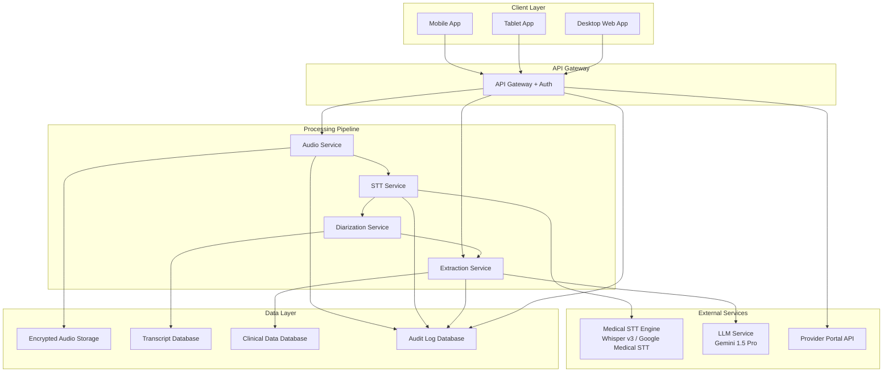

# Design Document: AI Allied Health Assessment Automator

## Overview

The AI Allied Health Assessment Automator is a cloud-based clinical documentation system that transforms consultation audio into structured assessment data. The system employs a multi-stage processing pipeline: audio capture → transcription → speaker diarization → clinical entity extraction → human review → portal integration.

The architecture follows a microservices pattern with clear separation between capture, processing, review, and integration layers. All components communicate via secure REST APIs with end-to-end encryption. The system prioritizes clinical accuracy through human-in-the-loop validation while maximizing automation to reduce documentation burden.

**Technology Stack:**
- **Backend**: Python (FastAPI/Flask) - ideal for AI/ML integrations (Whisper, Gemini, pyannote.audio)
- **Frontend**: React with TypeScript - type-safe UI development
- **Database**: PostgreSQL with encryption at rest
- **Storage**: AWS S3 or Azure Blob Storage for encrypted audio files
- **Message Queue**: Redis for async processing
- **Testing**: pytest for unit tests, Hypothesis for property-based tests

**Key Design Principles:**
- Security-first: All PHI/PII encrypted at rest and in transit
- Human-in-the-loop: No automatic submission without clinician validation
- Privacy-by-design: Zero data retention, private AI instances
- Fail-safe: Graceful degradation with data preservation
- Audit-ready: Comprehensive logging for compliance

## Architecture

### System Architecture



### Data Flow

1. **Input Selection Phase**: Client app presents input method choice → clinician selects method → workflow adapts
2. **Consent Phase** (live recording only): Display consent form → obtain consent → enable recording
3. **Capture/Upload Phase**: 
   - Live recording: Record audio → encrypt locally → upload to Audio Service
   - Audio upload: Select file → validate → encrypt → upload to Audio Service
   - Transcript upload: Upload file or paste text → validate → skip to extraction
4. **Transcription Phase** (audio only): Audio Service → STT Engine → raw transcript → Diarization Service → labeled transcript
5. **Extraction Phase**: Labeled transcript → LLM with OT Form schema → JSON clinical data (38 fields across 9 categories)
6. **Review Phase**: Client fetches transcript + extracted data → displays side-by-side → clinician validates
7. **Submission Phase**: Validated data → API Gateway → Portal API → confirmation

### Security Architecture

- **Encryption at Rest**: AES-256 for all stored data (audio, transcripts, clinical data, audit logs)
- **Encryption in Transit**: TLS 1.3 for all API communications
- **Authentication**: OAuth 2.0 with JWT tokens, role-based access control (RBAC)
- **Authorization**: Clinician-level permissions, audit trail for all data access
- **Network Security**: VPC isolation, private subnets for processing services
- **Key Management**: AWS KMS or Azure Key Vault for encryption key rotation

## Components and Interfaces

### 1. Input Method Selection Component

**Responsibility**: Present input method options and route to appropriate workflow.

**Interfaces**:
```typescript
// React Frontend (TypeScript)
interface InputMethodSelector {
  // Display input method options
  displayInputMethods(): void
  
  // Handle method selection
  selectMethod(method: 'live-recording' | 'audio-upload' | 'transcript-upload'): void
  
  // Update workflow visibility
  updateWorkflowSteps(method: string): void
}

interface WorkflowConfiguration {
  method: 'live-recording' | 'audio-upload' | 'transcript-upload'
  requiresConsent: boolean
  requiresTranscription: boolean
  steps: WorkflowStep[]
}

interface WorkflowStep {
  id: string
  title: string
  visible: boolean
  completed: boolean
}
```

**Implementation Notes**:
- Display three clear options with descriptions and feature lists
- Show workflow steps dynamically based on selection
- Hide irrelevant steps (consent for uploads, transcription for transcript upload)
- Provide visual indicators for each method's requirements

### 1a. Audio Capture Component

**Responsibility**: Capture consultation audio across multiple device types with consent management.

**Interfaces**:
```python
# Python Backend API
class AudioCaptureService:
    """Audio capture service for handling recording sessions"""
    
    def start_recording(self, session_id: str, consent_data: ConsentRecord) -> RecordingSession:
        """Start recording with consent"""
        pass
    
    def stop_recording(self, session_id: str) -> EncryptedAudioFile:
        """Stop recording and return encrypted audio"""
        pass
    
    def get_recording_status(self, session_id: str) -> RecordingStatus:
        """Get recording status"""
        pass
    
    def upload_audio(self, audio_file: EncryptedAudioFile) -> AudioUploadResponse:
        """Upload audio to backend storage"""
        pass

@dataclass
class ConsentRecord:
    session_id: str
    consent_method: Literal['digital_signature', 'verbal_timestamp']
    timestamp: datetime
    clinician_id: str
    client_id: Optional[str] = None
    signature_data: Optional[str] = None

@dataclass
class RecordingSession:
    session_id: str
    start_time: datetime
    status: Literal['recording', 'paused', 'stopped']
    duration: int
```

```typescript
// React Frontend (TypeScript)
interface AudioCaptureClient {
  startRecording(sessionId: string, consentData: ConsentRecord): Promise<RecordingSession>
  stopRecording(sessionId: string): Promise<EncryptedAudioFile>
  getRecordingStatus(sessionId: string): Promise<RecordingStatus>
  uploadAudio(audioFile: EncryptedAudioFile): Promise<AudioUploadResponse>
}
```

**Implementation Notes**:
- Use Web Audio API for browser-based capture
- Use native audio APIs for mobile (AVAudioRecorder for iOS, MediaRecorder for Android)
- Implement local AES-256 encryption before upload
- Support pause/resume functionality
- Implement audio quality checks (sample rate, bit depth)

### 1b. Audio Upload Component

**Responsibility**: Accept and process pre-recorded audio files.

**Interfaces**:
```typescript
// React Frontend (TypeScript)
interface AudioUploadClient {
  selectAudioFile(): Promise<File>
  validateAudioFile(file: File): ValidationResult
  uploadAudioFile(file: File): Promise<AudioUploadResponse>
  getUploadProgress(uploadId: string): Promise<UploadProgress>
}

interface ValidationResult {
  valid: boolean
  errors: string[]
  fileSize: number
  format: string
  duration?: number
}

interface AudioUploadResponse {
  uploadId: string
  status: 'success' | 'failed'
  audioRecordingId?: string
  errorMessage?: string
}

interface UploadProgress {
  uploadId: string
  bytesUploaded: number
  totalBytes: number
  percentComplete: number
  status: 'uploading' | 'processing' | 'complete' | 'failed'
}
```

**Implementation Notes**:
- Support common audio formats: MP3, WAV, M4A, FLAC, OGG
- Maximum file size: 500MB
- Validate format and size before upload
- Show upload progress indicator
- Encrypt file before transmission
- Proceed to transcription after successful upload

### 1c. Transcript Upload Component

**Responsibility**: Accept and process existing transcripts.

**Interfaces**:
```typescript
// React Frontend (TypeScript)
interface TranscriptUploadClient {
  selectTranscriptFile(): Promise<File>
  pasteTranscriptText(text: string): void
  validateTranscript(content: string): ValidationResult
  uploadTranscript(content: string): Promise<TranscriptUploadResponse>
}

interface TranscriptUploadResponse {
  transcriptId: string
  status: 'success' | 'failed'
  wordCount: number
  errorMessage?: string
}
```

**Implementation Notes**:
- Support text formats: TXT, DOCX, PDF
- Provide text area for pasting transcript content
- Validate content is not empty
- Skip transcription step entirely
- Proceed directly to extraction after upload
- Format transcript for extraction pipeline

### 1d. Consent Management Component

**Responsibility**: Obtain and record client consent for live recording only.

**Interfaces**:
```python
# Python Backend API
class ConsentService:
    """Consent management service for live recording"""
    
    def display_consent_form(self, session_id: str) -> ConsentForm:
        """Display consent form for live recording"""
        pass
    
    def record_consent(self, consent_data: ConsentRecord) -> ConsentResponse:
        """Record consent decision"""
        pass
    
    def verify_consent(self, session_id: str) -> bool:
        """Verify consent was obtained"""
        pass

@dataclass
class ConsentForm:
    session_id: str
    consent_text: str
    consent_methods: List[Literal['digital_signature', 'verbal_timestamp']]

@dataclass
class ConsentResponse:
    consent_id: str
    session_id: str
    granted: bool
    timestamp: datetime
```

**Implementation Notes**:
- Only display for live recording input method
- Skip entirely for audio upload and transcript upload
- Support digital signature and verbal timestamp
- Store consent with encryption
- Block recording if consent not obtained

### 2. Speech-to-Text Service

**Responsibility**: Transcribe audio with medical vocabulary support and streaming capability.

**Interfaces**:
```python
# Python Backend API
class STTService:
    """Speech-to-Text service with medical vocabulary support"""
    
    def transcribe(self, audio_file: EncryptedAudioFile, options: TranscriptionOptions) -> TranscriptionJob:
        """Submit audio for transcription"""
        pass
    
    def get_transcription_status(self, job_id: str) -> TranscriptionStatus:
        """Get transcription status"""
        pass
    
    async def stream_transcription(self, audio_stream: AudioStream) -> AsyncIterator[TranscriptSegment]:
        """Stream transcription results for live view"""
        pass
    
    def get_transcript(self, job_id: str) -> Transcript:
        """Get final transcript"""
        pass

@dataclass
class TranscriptionOptions:
    language: str
    medical_vocabulary: bool
    enable_diarization: bool
    streaming_mode: bool

@dataclass
class Transcript:
    job_id: str
    text: str
    segments: List[TranscriptSegment]
    confidence: float
    processing_time: int

@dataclass
class TranscriptSegment:
    text: str
    start_time: float
    end_time: float
    confidence: float
    speaker: Optional[str] = None
```

**Implementation Notes**:
- Primary: OpenAI Whisper v3 (large model) for high accuracy
- Alternative: Google Cloud Medical Speech-to-Text API
- Configure with medical/clinical vocabulary lists
- Implement retry logic with exponential backoff
- Cache transcription results in encrypted database
- Support both batch and streaming modes

### 3. Speaker Diarization Service

**Responsibility**: Identify and label distinct speakers in the transcript.

**Interfaces**:
```python
# Python Backend API
class DiarizationService:
    """Speaker diarization service using pyannote.audio"""
    
    def diarize(self, transcript: Transcript, audio_file: EncryptedAudioFile) -> DiarizedTranscript:
        """Perform speaker diarization"""
        pass
    
    def assign_speaker_roles(self, diarized_transcript: DiarizedTranscript, 
                            role_mapping: Dict[str, SpeakerRole]) -> DiarizedTranscript:
        """Assign speaker roles"""
        pass

@dataclass
class DiarizedTranscript:
    job_id: str
    segments: List[DiarizedSegment]
    speakers: List[Speaker]
    confidence: float

@dataclass
class DiarizedSegment(TranscriptSegment):
    speaker_id: str
    speaker_role: Optional[Literal['clinician', 'client', 'carer', 'unknown']] = None
    confidence: float = 0.0

@dataclass
class Speaker:
    speaker_id: str
    role: Optional[Literal['clinician', 'client', 'carer', 'unknown']] = None
    segment_count: int = 0

SpeakerRoleMapping = Dict[str, Literal['clinician', 'client', 'carer']]
```

**Implementation Notes**:
- Use pyannote.audio or similar diarization library
- Implement speaker clustering algorithm
- Allow clinician to manually assign speaker roles in UI
- Handle overlapping speech gracefully
- Mark low-confidence segments for review

### 4. Clinical Data Extraction Service

**Responsibility**: Extract structured clinical entities from diarized transcript using LLM.

**Interfaces**:
```python
# Python Backend API
class ExtractionService:
    """Clinical data extraction service using Gemini 1.5 Pro"""
    
    def extract_clinical_data(self, transcript: DiarizedTranscript) -> ExtractedClinicalData:
        """Extract clinical data from transcript"""
        pass
    
    def re_extract_field(self, transcript: DiarizedTranscript, field_name: str) -> FieldExtraction:
        """Re-extract specific fields"""
        pass
    
    def validate_extraction(self, extraction: ExtractedClinicalData) -> ValidationResult:
        """Validate extraction quality"""
        pass

@dataclass
class ExtractedClinicalData:
    session_id: str
    client_information: ClientInformation
    referral_information: ReferralInformation
    medical_history: MedicalHistory
    functional_mobility: FunctionalMobility
    functional_selfcare: FunctionalSelfcare
    functional_domestic: FunctionalDomestic
    home_environment: HomeEnvironment
    cognitive_psychosocial: CognitivePsychosocial
    goals_plan: GoalsPlan
    extraction_metadata: ExtractionMetadata

@dataclass
class ClientInformation:
    client_name: Optional[FieldExtraction] = None
    dob: Optional[FieldExtraction] = None
    address: Optional[FieldExtraction] = None
    phone: Optional[FieldExtraction] = None
    emergency_contact: Optional[FieldExtraction] = None

@dataclass
class ReferralInformation:
    referral_source: Optional[FieldExtraction] = None
    referral_date: Optional[FieldExtraction] = None
    referral_reason: Optional[FieldExtraction] = None

@dataclass
class MedicalHistory:
    diagnosis: Optional[FieldExtraction] = None
    secondary_conditions: Optional[FieldExtraction] = None
    medications: Optional[FieldExtraction] = None
    allergies: Optional[FieldExtraction] = None

@dataclass
class FunctionalMobility:
    mobility_indoor: Optional[FieldExtraction] = None
    mobility_outdoor: Optional[FieldExtraction] = None
    transfers: Optional[FieldExtraction] = None
    stairs: Optional[FieldExtraction] = None
    falls_history: Optional[FieldExtraction] = None

@dataclass
class FunctionalSelfcare:
    bathing: Optional[FieldExtraction] = None
    dressing: Optional[FieldExtraction] = None
    grooming: Optional[FieldExtraction] = None
    toileting: Optional[FieldExtraction] = None
    feeding: Optional[FieldExtraction] = None

@dataclass
class FunctionalDomestic:
    meal_prep: Optional[FieldExtraction] = None
    housework: Optional[FieldExtraction] = None
    laundry: Optional[FieldExtraction] = None
    shopping: Optional[FieldExtraction] = None

@dataclass
class HomeEnvironment:
    home_type: Optional[FieldExtraction] = None
    home_access: Optional[FieldExtraction] = None
    bathroom_setup: Optional[FieldExtraction] = None
    home_hazards: Optional[FieldExtraction] = None

@dataclass
class CognitivePsychosocial:
    cognitive_status: Optional[FieldExtraction] = None
    mood: Optional[FieldExtraction] = None
    social_support: Optional[FieldExtraction] = None

@dataclass
class GoalsPlan:
    client_goals: Optional[FieldExtraction] = None
    assessment_summary: Optional[FieldExtraction] = None
    recommendations: Optional[FieldExtraction] = None

@dataclass
class FieldExtraction:
    value: str
    confidence: float
    source_segments: List[SourceSegment]
    flagged_for_review: bool

@dataclass
class SourceSegment:
    segment_id: str
    text: str
    start_time: float
    end_time: float
    speaker: str

@dataclass
class ExtractionMetadata:
    model_version: str
    extraction_time: datetime
    overall_confidence: float
    flagged_field_count: int
```

**Implementation Notes**:
- Use Gemini 1.5 Pro with structured output (JSON mode)
- Implement prompt engineering for clinical entity extraction
- Define JSON schema matching Assessment Form structure
- Set confidence thresholds for flagging fields (e.g., < 0.7)
- Extract source segments for each field for traceability
- Implement field-level re-extraction for corrections

**LLM Prompt Structure**:
```
You are a clinical documentation assistant. Extract structured OT assessment data from the following consultation transcript.

TRANSCRIPT:
[Diarized transcript with speaker labels]

Extract the following information in JSON format matching the OT Assessment Form structure with 38 fields across 9 categories:

{
  "client_information": {
    "client_name": {"value": "", "confidence": 0.0-1.0, "sourceText": ""},
    "dob": {"value": "", "confidence": 0.0-1.0, "sourceText": ""},
    "address": {"value": "", "confidence": 0.0-1.0, "sourceText": ""},
    "phone": {"value": "", "confidence": 0.0-1.0, "sourceText": ""},
    "emergency_contact": {"value": "", "confidence": 0.0-1.0, "sourceText": ""}
  },
  "referral_information": {
    "referral_source": {"value": "", "confidence": 0.0-1.0, "sourceText": ""},
    "referral_date": {"value": "", "confidence": 0.0-1.0, "sourceText": ""},
    "referral_reason": {"value": "", "confidence": 0.0-1.0, "sourceText": ""}
  },
  "medical_history": {
    "diagnosis": {"value": "", "confidence": 0.0-1.0, "sourceText": ""},
    "secondary_conditions": {"value": "", "confidence": 0.0-1.0, "sourceText": ""},
    "medications": {"value": "", "confidence": 0.0-1.0, "sourceText": ""},
    "allergies": {"value": "", "confidence": 0.0-1.0, "sourceText": ""}
  },
  "functional_mobility": {
    "mobility_indoor": {"value": "", "confidence": 0.0-1.0, "sourceText": ""},
    "mobility_outdoor": {"value": "", "confidence": 0.0-1.0, "sourceText": ""},
    "transfers": {"value": "", "confidence": 0.0-1.0, "sourceText": ""},
    "stairs": {"value": "", "confidence": 0.0-1.0, "sourceText": ""},
    "falls_history": {"value": "", "confidence": 0.0-1.0, "sourceText": ""}
  },
  "functional_selfcare": {
    "bathing": {"value": "", "confidence": 0.0-1.0, "sourceText": ""},
    "dressing": {"value": "", "confidence": 0.0-1.0, "sourceText": ""},
    "grooming": {"value": "", "confidence": 0.0-1.0, "sourceText": ""},
    "toileting": {"value": "", "confidence": 0.0-1.0, "sourceText": ""},
    "feeding": {"value": "", "confidence": 0.0-1.0, "sourceText": ""}
  },
  "functional_domestic": {
    "meal_prep": {"value": "", "confidence": 0.0-1.0, "sourceText": ""},
    "housework": {"value": "", "confidence": 0.0-1.0, "sourceText": ""},
    "laundry": {"value": "", "confidence": 0.0-1.0, "sourceText": ""},
    "shopping": {"value": "", "confidence": 0.0-1.0, "sourceText": ""}
  },
  "home_environment": {
    "home_type": {"value": "", "confidence": 0.0-1.0, "sourceText": ""},
    "home_access": {"value": "", "confidence": 0.0-1.0, "sourceText": ""},
    "bathroom_setup": {"value": "", "confidence": 0.0-1.0, "sourceText": ""},
    "home_hazards": {"value": "", "confidence": 0.0-1.0, "sourceText": ""}
  },
  "cognitive_psychosocial": {
    "cognitive_status": {"value": "", "confidence": 0.0-1.0, "sourceText": ""},
    "mood": {"value": "", "confidence": 0.0-1.0, "sourceText": ""},
    "social_support": {"value": "", "confidence": 0.0-1.0, "sourceText": ""}
  },
  "goals_plan": {
    "client_goals": {"value": "", "confidence": 0.0-1.0, "sourceText": ""},
    "assessment_summary": {"value": "", "confidence": 0.0-1.0, "sourceText": ""},
    "recommendations": {"value": "", "confidence": 0.0-1.0, "sourceText": ""}
  }
}

Rules:
- Only extract information explicitly stated in the transcript
- Prioritize client and carer statements for subjective data
- Prioritize clinician statements for observations
- Include confidence score (0.0-1.0) for each field
- Include the exact source text that supports each extraction
- Use null for fields not mentioned in the transcript
- Follow OT Assessment Form structure with 38 fields across 9 categories
```

### 5. Review Interface Component

**Responsibility**: Present side-by-side transcript and extracted data for clinician validation.

**Interfaces**:
```typescript
interface ReviewInterfaceService {
  // Load review session
  loadReviewSession(sessionId: string): Promise<ReviewSession>
  
  // Update field value
  updateField(sessionId: string, fieldPath: string, newValue: string): Promise<void>
  
  // Manually assign transcript segment to field
  assignSegmentToField(sessionId: string, fieldPath: string, segmentIds: string[]): Promise<void>
  
  // Mark field as validated
  markFieldValidated(sessionId: string, fieldPath: string): Promise<void>
  
  // Get validation status
  getValidationStatus(sessionId: string): Promise<ValidationStatus>
  
  // Submit validated data
  submitToPortal(sessionId: string): Promise<SubmissionResult>
}

interface ReviewSession {
  sessionId: string
  transcript: DiarizedTranscript
  extractedData: ExtractedClinicalData
  validationStatus: ValidationStatus
  mode: 'draft' | 'validated' | 'submitted'
}

interface ValidationStatus {
  totalFields: number
  validatedFields: number
  flaggedFields: number
  readyForSubmission: boolean
}
```

**UI Components**:
- **Transcript Panel**: Scrollable transcript with speaker labels, timestamps, and highlighting
- **Form Panel**: Assessment form with auto-populated fields, confidence indicators, and edit controls
- **Link Visualization**: Click field → highlight source segments in transcript
- **Manual Assignment**: Drag-and-drop or click-to-assign transcript segments to fields
- **Validation Controls**: Checkboxes or buttons to mark fields as validated
- **Progress Indicator**: Visual progress bar showing validation completion
- **Submit Button**: Enabled only when all required fields validated

### 6. Portal Integration Service

**Responsibility**: Submit validated assessment data to provider portal via REST API.

**Interfaces**:
```typescript
interface PortalIntegrationService {
  // Submit assessment data
  submitAssessment(assessmentData: ValidatedAssessmentData): Promise<SubmissionResult>
  
  // Retry failed submission
  retrySubmission(submissionId: string): Promise<SubmissionResult>
  
  // Get submission status
  getSubmissionStatus(submissionId: string): Promise<SubmissionStatus>
}

interface ValidatedAssessmentData {
  sessionId: string
  clinicianId: string
  clientId: string
  assessmentDate: Date
  formData: AssessmentFormData
  metadata: SubmissionMetadata
}

interface AssessmentFormData {
  demographics: Record<string, any>
  clinicalHistory: Record<string, any>
  functionalStatus: Record<string, any>
  goalsAspirations: Record<string, any>
  riskAssessment: Record<string, any>
}

interface SubmissionResult {
  submissionId: string
  status: 'success' | 'failure' | 'pending'
  portalRecordId?: string
  errorMessage?: string
  timestamp: Date
}

interface SubmissionMetadata {
  sourceSystem: string
  sourceVersion: string
  submissionMethod: 'automated'
  validatedBy: string
  validationTimestamp: Date
}
```

**Implementation Notes**:
- Implement retry logic with exponential backoff (max 3 retries)
- Queue failed submissions for later retry
- Validate payload against Portal API schema before submission
- Log all submission attempts to audit database
- Handle Portal API rate limits gracefully

### 7. Audit Logging Service

**Responsibility**: Comprehensive logging of all system actions for compliance and debugging.

**Interfaces**:
```typescript
interface AuditLoggingService {
  // Log consent event
  logConsent(consentRecord: ConsentRecord): Promise<void>
  
  // Log recording event
  logRecording(sessionId: string, duration: number, clinicianId: string): Promise<void>
  
  // Log transcription event
  logTranscription(jobId: string, processingTime: number, confidence: number): Promise<void>
  
  // Log extraction event
  logExtraction(sessionId: string, extractionMetadata: ExtractionMetadata): Promise<void>
  
  // Log field edit
  logFieldEdit(sessionId: string, fieldPath: string, clinicianId: string, oldValue: string, newValue: string): Promise<void>
  
  // Log submission event
  logSubmission(submissionResult: SubmissionResult, clinicianId: string): Promise<void>
  
  // Query audit logs
  queryAuditLogs(filters: AuditLogFilters): Promise<AuditLog[]>
}

interface AuditLog {
  logId: string
  timestamp: Date
  eventType: string
  sessionId?: string
  clinicianId?: string
  details: Record<string, any>
  ipAddress?: string
}

interface AuditLogFilters {
  startDate?: Date
  endDate?: Date
  sessionId?: string
  clinicianId?: string
  eventType?: string
}
```

**Implementation Notes**:
- Store audit logs in separate encrypted database
- Implement log retention policy (e.g., 7 years for healthcare)
- Include IP address, user agent, and session context
- Implement log aggregation for compliance reporting
- Ensure logs are immutable (append-only)

## Data Models

### Audio Recording

```typescript
interface AudioRecording {
  recordingId: string
  sessionId: string
  clinicianId: string
  clientId?: string
  recordingDate: Date
  duration: number
  fileSize: number
  encryptedFilePath: string
  encryptionKeyId: string
  format: string
  sampleRate: number
  consentRecordId: string
  status: 'uploaded' | 'processing' | 'transcribed' | 'failed'
  createdAt: Date
  updatedAt: Date
}
```

### Transcript

```typescript
interface TranscriptRecord {
  transcriptId: string
  recordingId: string
  sessionId: string
  rawText: string
  segments: DiarizedSegment[]
  speakers: Speaker[]
  overallConfidence: number
  processingTime: number
  sttEngine: string
  sttModelVersion: string
  diarizationConfidence: number
  status: 'completed' | 'failed'
  createdAt: Date
}
```

### Clinical Data Record

```typescript
interface ClinicalDataRecord {
  clinicalDataId: string
  sessionId: string
  transcriptId: string
  extractedData: ExtractedClinicalData
  validatedData?: ValidatedAssessmentData
  validationStatus: ValidationStatus
  validatedBy?: string
  validatedAt?: Date
  submissionId?: string
  status: 'draft' | 'validated' | 'submitted'
  createdAt: Date
  updatedAt: Date
}
```

### Consent Record

```typescript
interface ConsentRecordDB {
  consentId: string
  sessionId: string
  clinicianId: string
  clientId?: string
  consentMethod: 'digital_signature' | 'verbal_timestamp'
  timestamp: Date
  signatureData?: string
  encryptedSignaturePath?: string
  ipAddress: string
  deviceInfo: string
  createdAt: Date
}
```

### Submission Record

```typescript
interface SubmissionRecord {
  submissionId: string
  sessionId: string
  clinicalDataId: string
  clinicianId: string
  submissionDate: Date
  status: 'success' | 'failure' | 'pending' | 'retrying'
  portalRecordId?: string
  errorMessage?: string
  retryCount: number
  lastRetryAt?: Date
  payload: string // JSON string of submitted data
  createdAt: Date
  updatedAt: Date
}
```

## Correctness Properties

*A property is a characteristic or behavior that should hold true across all valid executions of a system—essentially, a formal statement about what the system should do. Properties serve as the bridge between human-readable specifications and machine-verifiable correctness guarantees.*


### Property 1: Audio Format Compliance
*For any* recording session initiated by a clinician, the captured audio file should meet medical transcription format specifications (appropriate sample rate, bit depth, and codec).
**Validates: Requirements 1.1**

### Property 2: Data Encryption at Rest
*For any* sensitive data stored by the system (audio files, transcripts, clinical data, consent records, audit logs), the stored data should be encrypted using AES-256 encryption.
**Validates: Requirements 1.3, 2.5, 7.1, 7.2, 7.3, 7.6, 14.7**

### Property 3: Error Notification and Preservation
*For any* audio capture failure, the system should both notify the clinician and preserve any partial recording data.
**Validates: Requirements 1.4**

### Property 4: Consent Before Recording
*For any* attempt to start recording, the system should block the recording if consent has not been obtained.
**Validates: Requirements 2.1, 2.4**

### Property 5: Consent Persistence Round-Trip
*For any* consent provided (digital signature or verbal timestamp), storing then retrieving the consent record should return all required fields (timestamp, method, clinician ID).
**Validates: Requirements 2.3**

### Property 6: Transcript Persistence Round-Trip
*For any* completed transcription, the system should save the transcript such that it can be retrieved for future reference with all segments and metadata intact.
**Validates: Requirements 3.6**

### Property 7: Transcription Error Handling
*For any* transcription failure, the system should both notify the clinician and preserve the original audio file to enable retry.
**Validates: Requirements 3.7**

### Property 8: Streaming Transcript Availability
*For any* active recording with streaming transcription enabled, transcript data should be available and updated in real-time during the recording session.
**Validates: Requirements 3.4, 3.5, 13.5**

### Property 9: Speaker Identification and Labeling
*For any* audio containing multiple speakers, the diarization process should identify distinct speakers and assign unique labels to each speaker.
**Validates: Requirements 4.1**

### Property 10: Speaker Role Assignment
*For any* diarized transcript with role mapping provided, all segments should be annotated with the correct speaker role (clinician, client, or carer).
**Validates: Requirements 4.2**

### Property 11: Complete Speaker Annotation
*For any* completed diarization, all transcript segments should have speaker labels assigned.
**Validates: Requirements 4.3**

### Property 12: Low-Confidence Speaker Flagging
*For any* diarization segment with confidence below the threshold, the segment should be flagged for clinician review.
**Validates: Requirements 4.4**

### Property 13: Speaker Consistency Invariant
*For any* diarized transcript, the same speaker ID should represent the same person throughout the entire transcript (speaker IDs are consistent).
**Validates: Requirements 4.5**

### Property 14: Complete Clinical Field Extraction
*For any* transcript submitted for extraction, the output should contain all required clinical field categories (demographics, clinical history, functional status, goals/aspirations, risk assessment) in the JSON structure.
**Validates: Requirements 5.1, 5.2, 5.3, 5.4, 5.5**

### Property 15: Extraction Schema Compliance
*For any* extracted clinical data, the output should be valid JSON matching the Assessment_Form field structure schema.
**Validates: Requirements 5.6**

### Property 16: Low-Confidence Field Flagging
*For any* extracted field with confidence below the threshold, the field should be flagged for clinician attention.
**Validates: Requirements 5.7**

### Property 17: Source Segment Traceability
*For any* auto-populated form field, the system should maintain and provide access to the source transcript segments that generated that field value.
**Validates: Requirements 6.2, 15.6**

### Property 18: Draft Mode Default State
*For any* newly extracted clinical data, the initial state should be Draft_Mode requiring explicit clinician validation.
**Validates: Requirements 6.3, 11.2**

### Property 19: Field Edit Persistence
*For any* clinician edit to a form field, the system should persist the edit and mark the field as manually validated.
**Validates: Requirements 6.4**

### Property 20: Manual Segment Assignment
*For any* manual assignment of transcript segments to a form field, the system should correctly store the assignment and link the segments to the field.
**Validates: Requirements 6.5, 15.2**

### Property 21: Validation-Gated Submission
*For any* review session, the submit action should only be enabled when all required fields have been validated.
**Validates: Requirements 6.6**

### Property 22: TLS Encryption in Transit
*For any* data transmission (including portal communication), the system should use TLS 1.2 or higher encryption.
**Validates: Requirements 7.4, 7.5, 10.5**

### Property 23: PII Detection and Redaction
*For any* transcript with PII redaction enabled, identified sensitive information should be redacted before storage.
**Validates: Requirements 8.1, 8.2**

### Property 24: Redaction Override
*For any* redaction decision, clinicians should be able to review and override the redaction, and the override should be correctly applied.
**Validates: Requirements 8.4**

### Property 25: Redaction Audit Logging
*For any* redaction event, a corresponding audit log entry should be created.
**Validates: Requirements 8.5**

### Property 26: Approved Endpoint Restriction
*For any* consultation data transmission, the data should only be sent to approved endpoints that do not perform model training.
**Validates: Requirements 9.3**

### Property 27: External Service Audit Trail
*For any* interaction with external AI services, audit logs should confirm the data retention policy compliance.
**Validates: Requirements 9.5**

### Property 28: Portal Payload Schema Compliance
*For any* validated assessment data approved for submission, the formatted JSON payload should match the Portal API specifications.
**Validates: Requirements 10.1**

### Property 29: Portal API Transmission
*For any* submission initiation, the system should transmit the data to the Portal via the RESTful API endpoint.
**Validates: Requirements 10.2**

### Property 30: Submission Success Confirmation
*For any* successful portal integration, the system should provide confirmation to the clinician.
**Validates: Requirements 10.3**

### Property 31: Submission Failure Recovery
*For any* failed portal submission, the system should preserve the validated data and provide retry capability.
**Validates: Requirements 10.4**

### Property 32: Comprehensive Event Audit Logging
*For any* significant system event (consent, recording, transcription, extraction, edit, submission), a corresponding audit log entry should be created with required metadata (timestamp, user, event-specific details).
**Validates: Requirements 14.1, 14.2, 14.3, 14.4, 14.5, 14.6, 10.6**

### Property 33: No Auto-Submission Safety
*For any* extracted clinical data, the system should never automatically submit to the Portal without explicit clinician approval action.
**Validates: Requirements 11.1**

### Property 34: Draft Mode Submission Block
*For any* data in Draft_Mode, automatic submission should be disabled.
**Validates: Requirements 11.3**

### Property 35: Explicit Transition Requirement
*For any* transition from Draft_Mode to submission, an explicit clinician action should be required.
**Validates: Requirements 11.4**

### Property 36: Unvalidated Submission Prevention
*For any* submission attempt with unvalidated required fields, the system should prevent submission and prompt for review.
**Validates: Requirements 11.5**

### Property 37: Data Preservation Across Failures
*For any* processing step failure (transcription, extraction, or submission), all data from previous successful steps should be preserved intact.
**Validates: Requirements 12.1, 12.2, 12.3, 12.4**

### Property 38: Offline Queue and Sync
*For any* data ready for submission when network connectivity is lost, the system should queue the data and automatically submit when connectivity is restored.
**Validates: Requirements 12.6**

### Property 39: Automatic Extraction Progression
*For any* completed transcription, the extraction process should begin automatically without requiring manual intervention.
**Validates: Requirements 13.2**

### Property 40: Manual Assignment Precedence
*For any* form field with both AI-extracted and manually-assigned content, the manual assignment should take precedence.
**Validates: Requirements 15.3**

### Property 41: Multiple Segment Assignment
*For any* form field, the system should support assignment of multiple transcript segments, and all assigned segments should be correctly linked to the field.
**Validates: Requirements 15.4**

### Property 42: Manual Assignment Auto-Validation
*For any* manual assignment of transcript segments to a field, the system should automatically mark the field as manually validated.
**Validates: Requirements 15.5**

## Error Handling

### Error Categories

1. **Capture Errors**
   - Microphone access denied
   - Storage quota exceeded
   - Audio format not supported
   - Encryption failure

2. **Transcription Errors**
   - STT service unavailable
   - Audio quality too poor
   - Unsupported audio format
   - Timeout during processing

3. **Extraction Errors**
   - LLM service unavailable
   - Invalid transcript format
   - Schema validation failure
   - Timeout during processing

4. **Integration Errors**
   - Portal API unavailable
   - Authentication failure
   - Invalid payload format
   - Network timeout

### Error Handling Strategies

**Graceful Degradation**:
- If streaming transcription fails, fall back to batch processing
- If diarization fails, proceed with undiarized transcript
- If extraction fails, allow manual data entry
- If portal submission fails, queue for retry

**Data Preservation**:
- Always preserve original audio on transcription failure
- Always preserve transcript on extraction failure
- Always preserve validated data on submission failure
- Implement automatic local backup before each processing step

**User Notification**:
- Display clear, actionable error messages
- Indicate what failed and what data was preserved
- Provide manual retry options
- Show progress of retry attempts

**Retry Logic**:
- Exponential backoff for transient failures (network, service unavailable)
- Maximum 3 automatic retries for API calls
- Manual retry option always available
- Queue failed submissions for background retry

**Logging and Monitoring**:
- Log all errors with full context (stack trace, input data, system state)
- Alert on repeated failures (> 3 in 10 minutes)
- Track error rates by category
- Generate error reports for compliance review

## Testing Strategy

### Dual Testing Approach

The system requires both **unit testing** and **property-based testing** for comprehensive coverage:

**Unit Tests**: Focus on specific examples, edge cases, and error conditions
- Specific consent scenarios (digital signature, verbal timestamp)
- Edge cases (empty audio, malformed transcripts, missing fields)
- Error conditions (service failures, network timeouts, invalid inputs)
- Integration points (Portal API, STT engine, LLM service)

**Property-Based Tests**: Verify universal properties across all inputs
- Generate random audio files, transcripts, and clinical data
- Test properties hold for all valid inputs (100+ iterations per test)
- Catch edge cases that manual test design might miss
- Validate invariants and round-trip properties

### Property-Based Testing Configuration

**Framework**: Use **fast-check** (TypeScript/JavaScript) or **Hypothesis** (Python) for property-based testing

**Test Configuration**:
- Minimum 100 iterations per property test
- Each test tagged with: **Feature: allied-health-assessment-automator, Property {N}: {property_text}**
- Custom generators for domain objects (audio files, transcripts, clinical data)
- Shrinking enabled to find minimal failing examples

**Example Property Test Structure**:
```typescript
// Feature: allied-health-assessment-automator, Property 2: Data Encryption at Rest
test('all stored sensitive data is encrypted with AES-256', async () => {
  await fc.assert(
    fc.asyncProperty(
      fc.record({
        audioFile: audioFileGenerator(),
        transcript: transcriptGenerator(),
        clinicalData: clinicalDataGenerator(),
      }),
      async (data) => {
        // Store data
        await storageService.store(data);
        
        // Retrieve raw stored data
        const storedData = await storageService.getRaw(data.id);
        
        // Verify encryption
        expect(isAES256Encrypted(storedData)).toBe(true);
      }
    ),
    { numRuns: 100 }
  );
});
```

### Test Coverage Requirements

**Unit Test Coverage**:
- Audio capture: consent flows, recording controls, format validation
- Transcription: STT integration, error handling, streaming mode
- Diarization: speaker detection, role assignment, confidence flagging
- Extraction: LLM integration, schema validation, field flagging
- Review UI: field editing, manual assignment, validation state
- Portal integration: API calls, retry logic, error handling
- Security: encryption, authentication, authorization
- Audit logging: event capture, log format, retention

**Property Test Coverage**:
- All 42 correctness properties from design document
- Each property implemented as a separate property-based test
- Custom generators for all domain objects
- Comprehensive input space coverage through randomization

### Integration Testing

**End-to-End Flows**:
1. Complete consultation flow: capture → transcribe → extract → review → submit
2. Error recovery flows: failure at each stage with retry
3. Offline mode: capture while offline, sync when online
4. Manual override flows: clinician edits and manual assignments

**External Service Integration**:
- Mock STT engine for deterministic testing
- Mock LLM service for extraction testing
- Mock Portal API for submission testing
- Test with real services in staging environment

### Security Testing

**Encryption Validation**:
- Verify AES-256 encryption for all stored data
- Verify TLS 1.2+ for all network communication
- Test key rotation procedures
- Validate encryption key access controls

**Authentication and Authorization**:
- Test role-based access control (RBAC)
- Test session management and token expiration
- Test unauthorized access attempts
- Validate audit logging of access attempts

**Compliance Testing**:
- Verify APP/HIPAA compliance requirements
- Test PII redaction functionality
- Validate zero data retention with external services
- Test audit log completeness and retention

### Performance Testing

**Latency Requirements**:
- Transcription: < 30 seconds for typical consultation (15-20 minutes)
- Extraction: < 10 seconds for typical transcript
- Review interface load: < 5 seconds
- Portal submission: < 3 seconds

**Load Testing**:
- Concurrent users: 100+ simultaneous recordings
- Storage: 10,000+ consultation records
- API throughput: 1,000+ requests per minute
- Database query performance: < 100ms for typical queries

**Stress Testing**:
- Large audio files (> 1 hour consultations)
- Long transcripts (> 50,000 words)
- High extraction complexity (> 100 clinical entities)
- Network degradation scenarios

## Implementation Notes

### Technology Stack Recommendations

**Backend**:
- **API Framework**: Node.js with Express or Python with FastAPI
- **Database**: PostgreSQL with encryption at rest
- **Storage**: AWS S3 with server-side encryption or Azure Blob Storage
- **Message Queue**: Redis or RabbitMQ for async processing
- **Authentication**: Auth0 or AWS Cognito for OAuth 2.0

**Frontend**:
- **Web**: React or Vue.js with TypeScript
- **Mobile**: React Native or Flutter for cross-platform
- **Audio Capture**: Web Audio API (browser), native APIs (mobile)
- **State Management**: Redux or Zustand

**AI Services**:
- **STT**: OpenAI Whisper v3 (self-hosted) or Google Cloud Medical Speech-to-Text
- **Diarization**: pyannote.audio (self-hosted)
- **LLM**: Google Gemini 1.5 Pro with structured output or OpenAI GPT-4 with function calling
- **Deployment**: Private instances with zero data retention agreements

**Infrastructure**:
- **Cloud Provider**: AWS or Azure with healthcare compliance (HIPAA BAA)
- **Encryption**: AWS KMS or Azure Key Vault
- **Monitoring**: CloudWatch or Application Insights
- **Logging**: ELK Stack or CloudWatch Logs

### Deployment Considerations

**Security Hardening**:
- Enable encryption at rest for all storage
- Configure TLS 1.3 for all endpoints
- Implement rate limiting and DDoS protection
- Enable Web Application Firewall (WAF)
- Regular security audits and penetration testing

**Compliance Requirements**:
- Sign Business Associate Agreement (BAA) with cloud provider
- Configure audit logging for all PHI access
- Implement data retention and deletion policies
- Enable multi-factor authentication (MFA) for all users
- Regular compliance audits (APP/HIPAA)

**Scalability**:
- Horizontal scaling for API servers
- Auto-scaling for processing pipeline
- Database read replicas for query performance
- CDN for static assets
- Caching layer for frequently accessed data

**Monitoring and Alerting**:
- Application performance monitoring (APM)
- Error tracking and alerting
- Audit log monitoring for suspicious activity
- Service health checks and uptime monitoring
- Cost monitoring and optimization

### Development Phases

**Phase 1: Core Capture and Transcription** (4-6 weeks)
- Audio capture on web and mobile
- Consent management
- STT integration with Whisper v3
- Basic error handling and retry logic

**Phase 2: Diarization and Extraction** (4-6 weeks)
- Speaker diarization integration
- LLM extraction with Gemini 1.5 Pro
- Schema validation and field flagging
- Confidence scoring

**Phase 3: Review Interface** (3-4 weeks)
- Side-by-side transcript and form UI
- Source segment highlighting
- Manual editing and validation
- Manual segment assignment

**Phase 4: Portal Integration** (2-3 weeks)
- Portal API client
- Submission workflow
- Retry logic and error handling
- Success/failure notifications

**Phase 5: Security and Compliance** (3-4 weeks)
- End-to-end encryption implementation
- PII redaction
- Comprehensive audit logging
- Compliance validation (APP/HIPAA)

**Phase 6: Testing and Optimization** (3-4 weeks)
- Property-based test implementation
- Integration testing
- Performance optimization
- Security testing

**Total Estimated Timeline**: 19-27 weeks (approximately 5-7 months)
